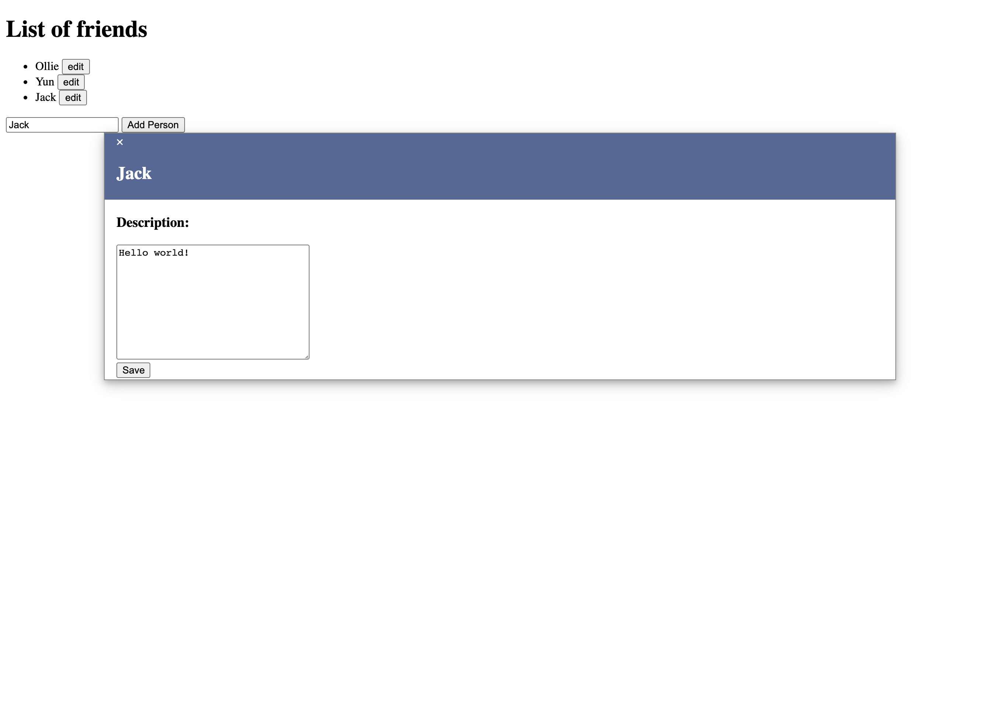

# Friend Directory

  
  

## Description 

This application allows you create a list of friends and descriptions of each friend.

See the URL for the deployed application: meierj423.github.io/friend-directory/

## Table of Contents

* [License](#license)
* [Questions](#questions)

## License

This application is covered under the MIT license.

## Questions

For any additional questions, please send me an e-mail at jackson.meier423@gmail.com

Link to my GitHub: https://github.com/meierj423
